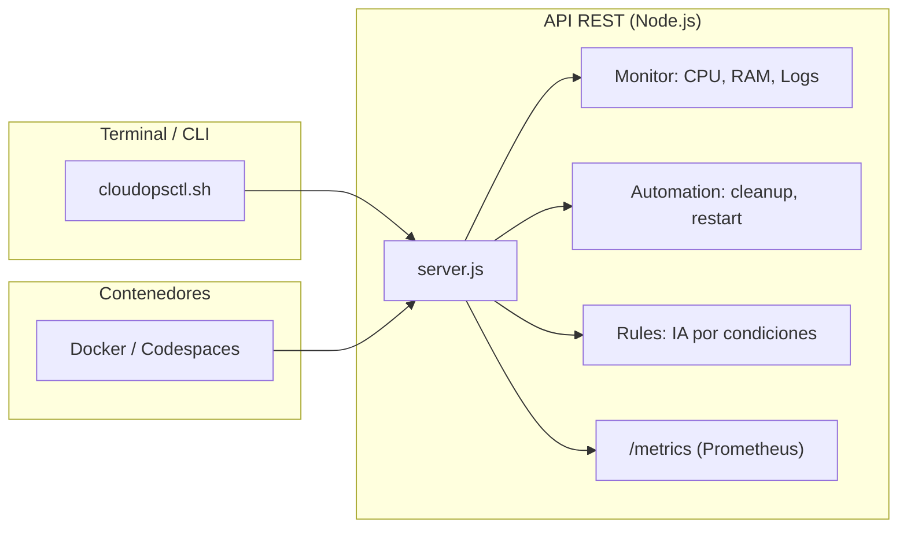

# 🧠 CloudOps Intelligent Monitoring System (CIMS)

> Monitoreo, automatización y observabilidad para **Cloud / SysOps / DevSecOps**, 100% operable desde terminal. Ideal para **Codespaces**, **Docker** o entornos locales. Este proyecto demuestra cómo mantener servicios con métricas, seguridad y control total desde consola.

<p align="left">
  
  
  
  
</p>

---

## 📌 Objetivos del proyecto

* **Operar desde consola:** CLI propia (`cloudopsctl.sh`) para interactuar con la API sin navegador.
* **Monitoreo en tiempo real:** CPU, RAM y logs del sistema.
* **Automatización SysOps:** limpieza de temporales y reinicio de servicios simulados.
* **Alertas inteligentes:** sistema de reglas que dispara eventos como `ALERT_HIGH_CPU`.
* **Observabilidad lista para producción:** métricas en `/metrics` compatibles con Prometheus.
* **Seguridad básica:** Helmet + validaciones con Joi.

---

## 🧱 Arquitectura (visión general)



> Modular, terminal-first y listo para observabilidad.

---

## 🧰 Tecnologías

* **Node.js 18+**
* **Express + Helmet**
* **Prometheus client (`prom-client`)**
* **CLI en Bash**
* **Docker / Codespaces**

---

## 📂 Estructura del repositorio

```
.
├── src/                    # Código fuente
│   ├── server.js           # API principal
│   ├── monitor/            # CPU, RAM, logs
│   ├── automation/         # Tareas simuladas
│   ├── ai/                 # Reglas de alertas
│   └── routes/             # Endpoints
├── cli/cloudopsctl.sh      # CLI para operar desde terminal
├── data/logs.json          # Logs del sistema
├── start.sh                # Script de arranque
├── Dockerfile              # Imagen base
├── docker-compose.yml      # Orquestación
└── README.md
```

> Modular y mantenible. El CLI es clave para la experiencia terminal.

---

## ⚙️ Instalación y ejecución

### 1) Local / Codespaces

```bash
npm install         # Instala dependencias
./start.sh          # Arranca el servicio en puerto 3000
```

### 2) Acceso

```text
http://localhost:3000/
https://TU-URL-3000.app.github.dev/  # En Codespaces
```

---

## 📡 Endpoints disponibles

| Método | Ruta                     | Descripción                          |
|--------|--------------------------|--------------------------------------|
| `GET`  | `/`                      | Bienvenida                           |
| `GET`  | `/health`                | Healthcheck                          |
| `GET`  | `/status`                | Métricas + alertas                   |
| `GET`  | `/logs`                  | Últimos logs                         |
| `GET`  | `/metrics`               | Métricas Prometheus                  |
| `POST` | `/automation/cleanup`    | Limpieza de temporales               |
| `POST` | `/automation/restart`    | Reinicio simulado de servicios       |

> Todas las rutas están protegidas con Helmet y validaciones básicas.

---

## 🖥️ CLI: cloudopsctl.sh

Operación directa desde terminal:

```bash
./cli/cloudopsctl.sh status
./cli/cloudopsctl.sh cleanup
./cli/cloudopsctl.sh restart webserver
```

Para apuntar a otra URL:

```bash
export CIMS_BASE_URL="https://mi-app.app.github.dev"
./cli/cloudopsctl.sh status
```

---

## 🧠 IA por reglas

Sistema de alertas basado en condiciones:

```json
{
  "name": "High CPU",
  "condition": {
    "metric": "cpu.load1_pct",
    "operator": ">",
    "value": 75
  },
  "action": "ALERT_HIGH_CPU"
}
```

Puedes editar `src/ai/rules.json` para agregar reglas por RAM, logs, etc.

---

## 🐳 Docker (opcional)

```bash
docker-compose up --build
```

Levanta el servicio en contenedor, listo para producción o pruebas.

---

## 📈 Observabilidad

* **Métricas Prometheus** en `/metrics`
* **Logs persistentes** en `data/logs.json`
* **Alertas activas** en `/status`

---

## 🛡️ Seguridad

* Middleware `helmet` activado.
* Validaciones con `joi`.
* Estructura lista para JWT / API keys.

---

## 🧪 Smoke tests

```bash
# 1) Arranque básico
./start.sh

# 2) Verificar salud
curl http://localhost:3000/health

# 3) Simular alerta
curl -X POST http://localhost:3000/automation/restart -H "Content-Type: application/json" -d '{"service":"webserver"}'
```

---

## 🗺️ Roadmap

* [ ] Exportación de reportes en JSON/Markdown
* [ ] Persistencia en SQLite
* [ ] Reglas configurables vía UI
* [ ] Integración con Grafana
* [ ] Autenticación JWT

---

## 🤝 Contribución

1. Forkea y crea un branch desde `main`.
2. Añade pruebas o mejoras en `cli/`, `src/ai/`, etc.
3. Asegura estilo y funcionalidad.
4. Abre PR con contexto y motivación.

---

## 📜 Licencia

**MIT** — libre uso en proyectos personales y empresariales.

---

## 👤 Autor

**© 2025 Emanuel González Michea**

* LinkedIn: [Tu perfil](https://www.linkedin.com/in/emanuel-gonzalez-michea/)
* GitHub: [Este repositorio](https://github.com/tu-usuario/cims)

---

¿Te gustaría que lo convierta también en una presentación estilo pitch técnico o en una página de documentación extendida?
